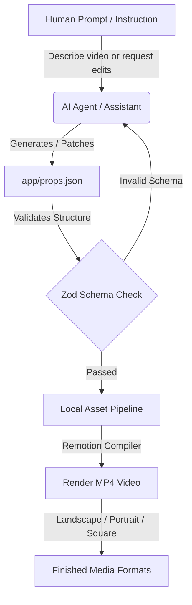
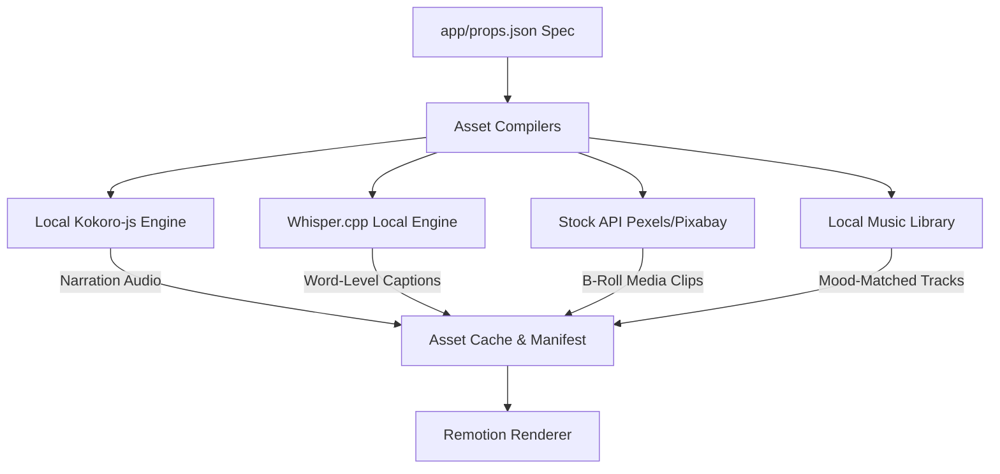

# 🎬 Declarative AI Video Studio (Remotion × AI)

A **free, local, developer-first video creation and editing studio** built on [Remotion](https://remotion.dev). Simply describe a video or request adjustments in plain English, and your AI coding assistant (such as **Antigravity**, **Codex**, or **Claude**) will compile a validated JSON specification and render a polished MP4 video. Complete with kinetic text animations, automatic local voiceovers, stock B-roll, background music, and multiple aspect ratios—**100% locally, with $0 cost per render and no API keys required.**

---

## 📌 Executive Overview

| Metric | Rating / Detail |
|---|---|
| ⏰ **Setup Time** | ~2 Minutes |
| 🟢 **Installation Difficulty** | Easy (Automated script) |
| 🟡 **Usage Difficulty** | Easy (AI-guided prompts) to Intermediate (Custom React/JSX edits) |
| 💵 **Cost per Render** | **$0.00** (Runs entirely on local CPU/GPU) |
| 🛡️ **Privacy & Security** | 100% Local (Secrets never leave your machine; code is unlicensed/private by default) |

---

## 🔍 What, Why, and Who

### What is this project?
This repository is a **declarative video rendering engine** that bridges the gap between text-based AI models and video generation. Instead of generating videos pixel-by-pixel (which is slow, low-resolution, and expensive), this project uses **React components** as the video elements and a **JSON file (`props.json`)** to define the timeline, text, layouts, transitions, and media assets. Your AI assistant acts as the editor by reading your prompt, updating the JSON spec, fetching free assets, and running the local renderer.

> [!IMPORTANT]
> **AI Video Editing vs. AI Video Generation**:
> This project is an **AI-assisted declarative editor, not a generative AI video tool**. It **does not** synthetically generate brand new visual pixels or creative scenes from scratch (like Sora, Runway, or Kling). Instead, it takes your **existing media assets** (video clips, photos, music, voiceovers) and automates the layout compiling, cutting, transition rendering, kinetic captioning, and brand styling based on your text prompt.


#### 💻 Tech Stack & Programming Languages
This project is built using a modern TypeScript/React web development stack (not Flutter/Dart):
* **React (TypeScript / TSX)**: Defines the layout, scenes, typography, and styling components.
* **Remotion**: The core engine compilation pipeline that translates React components into frames and renders them to MP4.
* **Node.js**: Powers the asset automation scripts (Text-to-Speech audio, Whisper subtitle transcription, and stock media scraping).
* **Tailwind CSS**: Provides the modern visual design utilities, gradients, and cards.

### Why does this project exist?
Traditional video editing has three major friction points:
1. **Manual Labor**: Cutting clips, timing captions, and aligning transitions manually in timeline software (Premiere/After Effects) takes hours.
2. **Aspect Ratios**: Re-editing a 16:9 horizontal video into 9:16 vertical and 1:1 square layouts requires rebuilding the layout from scratch.
3. **Prohibitive AI Costs**: Standard text-to-video APIs (Sora, Runaway, Kling) charge high per-second premiums and offer minimal control over specific text edits or layout designs.

This project solves this by using **Remotion's React-based compiler** to render files deterministically and instantly in any format from a single JSON specification.

### Who is this project for?
* **Content Creators & YouTubers** looking to automate short-form content (TikToks, Reels, Shorts) or video templates.
* **Developers & Indie Hackers** who want to build SaaS applications that generate videos programmatically.
* **AI Agencies & Marketers** looking to build high-volume video personalization campaigns (A/B testing ad variations).
* **Teams** who want to generate on-brand video assets locally without sending private materials to cloud servers.

---

## 📊 System Architecture & Pipelines

This studio operates via two key loops: the **Project Generation Loop** (how your prompts become specs) and the **Local Asset Pipeline** (how resources are compiled).

### 1. Unified Prompt-to-Render Loop


### 2. Local Asset Pipeline (Zero Keys Required)


---

## 🛠️ Step-by-Step Installation

### Prerequisites
Make sure you have [Node.js](https://nodejs.org) (v20 or v22 recommended) installed on your system.

### 1. Run Setup Script
Navigate to the `app` directory and run the idempotent setup script. This script automatically checks your environment, installs dependencies, builds local folders, and sets up your environment template:
```bash
cd app
./setup.sh
```

### 2. Render the Demo Video
Run the local compilation command to test your installation. It takes about 10 seconds to compile and render:
```bash
npm run render
```
Your finished video file will be saved directly to: `public/output/video.mp4`

### 3. Launch the Visual Preview Studio
Launch the interactive web browser preview to see your composition's timeline, assets, and frames in real-time:
```bash
npm run dev
```
*Open the local URL displayed in your terminal (typically `http://localhost:3000`) to inspect your timeline visually.*

---

## 🤖 AI-Agent Integration (Antigravity, Codex, Claude)

This repository is pre-configured with **AI Agent Skills** so that your coding assistant knows exactly how to drive the video studio out of the box:
* 🎯 **Antigravity**: Seamlessly executes video generation, asset configuration, and code edits.
* 🧠 **Codex**: Drives programmatic timeline updates and React component modifications.
* ⚡ **Claude (Claude Code / CLI)**: Reads the local context, patches `props.json` specifications, and triggers renders.

The pre-bundled workspace rules and skills (located in `.agents/skills/` and `.claude/skills/`) automatically guide these AI agents to execute non-destructive editing workflows on your behalf.

---

## ⚡ Everyday Usage & Workflows

Once setup is complete, you can collaborate with your AI assistant or run scripts manually to compile your specs:

### 1. Generate Voiceovers
Write your narration text inside `props.json` (`scenes[].voiceover.text`) and generate local ONNX-powered voice files:
```bash
npm run tts
```

### 2. Generate Karaoke Captions
Generate word-level timestamped captions by feeding the voiceover audio files into the local Whisper transcriber:
```bash
npm run captions
```

### 3. Fetch Stock Media (Optional)
If you have set search terms in `props.json` (`scenes[].backgroundMedia.query`), fetch royalty-free stock clips automatically:
```bash
# Set PEXELS_API_KEY or PIXABAY_API_KEY in your local app/.env first
npm run fetch-broll
```

### 4. Render Multiple Aspect Ratios
Render your spec into Landscape (16:9), Portrait (9:16), and Square (1:1) formats at the same time:
```bash
npm run render:formats
```

---

## 📥 Asset Management: Inputs & Outputs

All media files must be stored in the local file structure under the `app/public/` directory:

* **Input Assets (`app/public/input/`)**: 
  * Put all your raw video clips, images, brand logos, custom fonts, and audio tracks in this folder.
  * Your JSON specification (`props.json`) references these files relative to this folder (e.g., `"src": "input/my-logo.png"`).
* **Rendered Outputs (`app/public/output/`)**: 
  * Your final compiled video files (like `video.mp4`) and single-frame thumbnail images are rendered here.
  * **Note**: The entire content of the `public/output/` folder is git-ignored, meaning your renders will never clutter your GitHub repository.

---

## 📁 Repository Layout

```
├── .agents/                    # Custom agent instructions & best practices
├── .claude/                    # Claude Code specific workspace configurations
├── app/                        # Main video application folder
│   ├── brand.json              # Brand assets: palette colors, active typography, and logo
│   ├── props.json              # Current video specification layout
│   ├── setup.sh                # Main installation script
│   ├── package.json            # Node.js dependencies & execution scripts
│   ├── public/                 # Root asset folders
│   │   ├── input/              # Source clips, logos, and lo-fi tracks
│   │   └── output/             # Renders (ignored in Git history)
│   ├── scripts/                # Asset generation scripts (TTS, Whisper, stock b-roll)
│   └── src/                    # React components and rendering pipeline
├── DECISIONS.md                # Local developer logging history (private)
└── README.md                   # Main architecture and setup guide
```

---

## ⚖️ License

This repository is **private and unlicensed** by default (`"license": "UNLICENSED"`, `"private": true` inside [app/package.json](file:///Users/sajon/StudioProjects/ai_video_editor/app/package.json)). 

* You are free to customize, host, and push this repository to your own public/private GitHub profiles.
* If you plan to distribute this package for public npm usage, remove the `"private": true` property and set an open-source license (such as MIT) in your package files.
