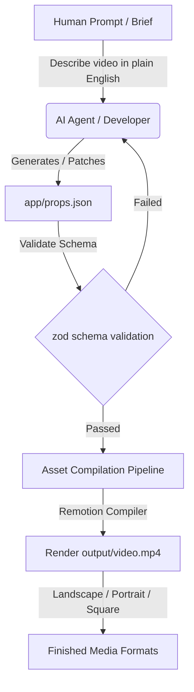
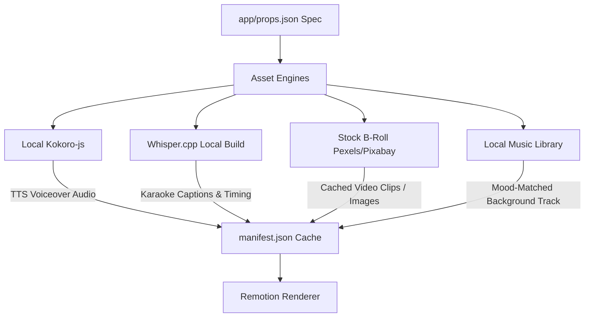

# AI Video Editor & Rendering Studio

A **free, AI-driven video creation and editing studio** built on [Remotion](https://remotion.dev). Describe a video or requesting edits in plain English, and your AI coding assistant (like Gemini or Claude) will write a validated JSON specification and render a polished MP4 video complete with transitions, kinetic text overlays, local voiceovers, stock B-roll, background music, and multiple aspect ratios—**100% locally, with $0 cost per render and no API keys required.**

---

## 🚀 Quick Start (2-Minute Setup)

1. **Install Dependencies**
   Navigate to the app directory and run the setup script:
   ```bash
   cd app
   ./setup.sh
   ```
   *This script validates Node, installs dependencies, ensures required asset directories, and copies the `.env` template.*

2. **Render the Demo Video**
   Render the default showcase video locally (takes ~10 seconds):
   ```bash
   npm run render
   ```
   Your finished video will be saved to: `public/output/video.mp4`

3. **Launch the Visual Preview Studio**
   View your video timeline in real-time and inspect properties visually:
   ```bash
   npm run dev
   ```
   Open the link in your browser to inspect or test your composition.

---

## 📊 Studio Architecture & Workflow

Here is how the AI Video Studio compiles high-quality videos from plain English prompts:

### 1. Unified Project Workflow


### 2. Local Asset Pipeline (Keys Optional)


---

## 🤖 Automating Video Production with AI Skills

This repository is pre-configured with **AI Agent Skills** so that your coding assistant knows exactly how to drive the video studio. The skills are located in the `.claude/skills/` and `.agents/skills/` directories.

### Method 1: Pre-Configured Workspace (Recommended)
By cloning this repository, the skills are already installed in your workspace. When you start an assistant session (like Antigravity or Claude Code), the assistant automatically discovers and activates the skills to perform tasks such as:
- `/new-video` — Generates a new `props.json` spec based on a prompt.
- `/edit-video` — Performs precise, non-destructive tweaks to individual scenes.
- `/add-captions` — Feeds voiceover audio into Whisper to generate subtitles.
- `/fetch-broll` — Uses Pexels/Pixabay stock queries to download media placeholders.

### Method 2: Global Skill Registry
If you are integrating this tool into another project, you can install the official Remotion skill using:
```bash
npx skills add remotion-dev/skills
```
*This command pulls the latest best practices and scripts directly into your project's agent folder.*

---

## 📜 Collaborative Decision Logging

When working with AI agents, keeping a clear history of decisions is critical. This project implements a strict logging rule:

> **RULE:** Every non-trivial decision about the video (colors, fonts, scenes, music, aspect ratio), scope, or tooling must be recorded in [`DECISIONS.md`](./DECISIONS.md) at the repository root, chronological and newest first.

### Example log structure:
```markdown
## YYYY-MM-DD
- **HH:MM** — Replaced heading font with Poppins for a cleaner editorial look.
- **HH:MM** — Muted standard stock background tracks and switched to cozy lo-fi music.
```

---

## 📁 File Structure

```
├── .agents/                    # Custom agent instructions & skills
├── .claude/                    # Claude Code specific skills
├── DECISIONS.md                # Shared developer/agent decision log
├── README.md                   # Visual setup and architecture guide
└── app/
    ├── brand.json              # Active brand name, logo path, and palette
    ├── props.json              # Active video composition specification
    ├── setup.sh                # Idempotent developer setup script
    ├── package.json            # Remotion studio dependencies
    ├── public/
    │   ├── input/              # Source clips, logos, and music
    │   └── output/             # Rendered videos and stills
    ├── scripts/                # Asset pipelines (TTS, Whisper, Stock fetch)
    └── src/                    # Remotion React component compositions
```

---

## 🛠️ Customization: Brand Colors & Fonts

To customize the video style, simply edit `app/brand.json`. Remotion will automatically update all background gradients, card containers, and titles:

```json
{
  "name": "My Brand Name",
  "palette": {
    "primary": "#4f46e5",
    "secondary": "#06b6d4",
    "background": "#0f172a",
    "text": "#f8fafc"
  },
  "fonts": {
    "heading": "Poppins",
    "body": "DMSans"
  }
}
```
For the full schema reference and listing of all CLI render options, see [`app/README.md`](./app/README.md) and [`app/CLAUDE.md`](./app/CLAUDE.md).
